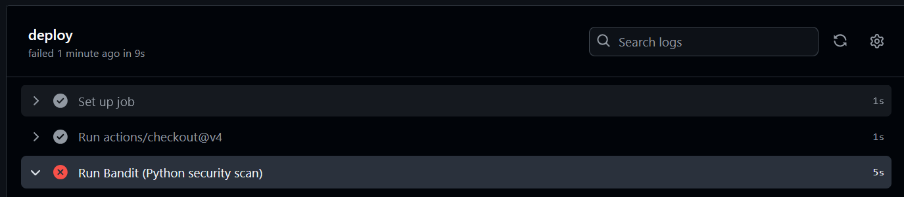

Cloud Security Pipeline

Overview
This repository demonstrates a realistic DevSecOps pipeline simulation, designed to securely automate the deployment of cloud-native applications. The project integrates industry-standard security practices, infrastructure-as-code, automated vulnerability scanning, and continuous deployment workflows within a controlled AWS environment. It's tailored specifically for portfolio demonstration, technical interviews, and learning purposes.

Key Features

- Infrastructure as Code: Automated, repeatable AWS provisioning via Terraform, including support for LocalStack for local validation.
- Vulnerable Reference Application: A purpose-built Python Flask web application designed to test security tooling.
- End-to-End CI/CD Pipeline: GitHub Actions orchestrate linting, dependency checks, static code analysis, container image scanning, and automated deployment to AWS.
- Automated Dockerized Deployment: Pipeline builds, copies, and deploys the Dockerized application to an EC2 instance using secure, scripted workflows.
- Security Group Hardening: Only essential ports (22 for SSH, 5000 for Flask) are exposed; all other ports are explicitly blocked and verified via custom tooling.
- Port Verification Automation: Custom Python script (`/scripts/port_tester.py`) automatically audits the network configuration after each deployment to ensure adherence to least-privilege principles.
- Cloud Security Controls: Enforced least-privilege IAM roles, secure secrets management, network segmentation, and comprehensive AWS logging and monitoring (CloudTrail, GuardDuty).
- Automated Alerting and Reporting: Pipeline execution halts on any detected vulnerabilities or misconfigurations; security scan and deployment logs are generated for auditability.
- Automated Security Scan Reports: The `/reports` directory stores the latest Bandit (Python) and Trivy (Docker) scan results and deployment logs generated by the CI/CD pipeline. Reports are overwritten on each deployment to provide an up-to-date audit record of system security.

## Security Automation Demo

Our CI/CD pipeline executes automated security scans (Bandit, Trivy) on every code push. Deployments are blocked if vulnerabilities are found, ensuring security enforcement throughout development.

_Above: Bandit scan blocks deployment due to detected Python security issues._

Technology Stack

- Cloud Provider: AWS
- Infrastructure as Code: Terraform
- Application: Python Flask (intentionally vulnerable)
- CI/CD: GitHub Actions
- Security Tools: Bandit, Trivy, pip-audit, AWS CloudTrail, AWS GuardDuty

Repository Structure

cloud-security-pipeline/
│
├── app/ # Flask application code
│   └── tests/ # Automated pytest unit tests
├── infra/ # Terraform IaC definitions
├── .github/workflows/ # CI/CD pipeline workflows
├── scripts/ # Automation and verification scripts
│   └── port_tester.py # Automated port verification tool
├── docs/ # Project documentation
├── reports/ # Security scan and deployment logs
└── README.md

Unit Testing & API Documentation
Automated Unit Testing

- All Flask app endpoints are covered by automated unit tests in `/app/tests/test_app.py` using `pytest`.
- Tests validate the homepage, port-check endpoint, and the RESTful `/api/threat` API (including both GET and POST).
- Run tests locally with:
  cd app
  pytest tests/
- Test results are shown on each GitHub Actions run; deployment is blocked if any test fails.

REST API

- Implements a RESTful endpoint at `/api/threat`:
  - GET /api/threat: Returns all mock threat intelligence records as JSON.
  - POST /api/threat: Accepts a new threat record (JSON), appends to in-memory store, and returns the new record.
- Example usage:
  # Get threats
  curl http://localhost:5000/api/threat

  # Add a new threat
  curl -X POST -H "Content-Type: application/json" -d '{"type": "dos", "severity": "low"}' http://localhost:5000/api/threat

### Cloud Networking Note

The `/ping` endpoint runs a real `ping` command from the server (EC2 instance) to a target IP.  
**Note:** On most AWS setups, outbound ICMP (ping) is blocked by default for security reasons.  
If this endpoint returns a blank page or no output, it’s due to AWS network/firewall rules, not an app error.  
This is a best practice in cloud security, and the rest of the project functions normally regardless.

Developer Documentation

- All critical code and tests are fully commented for onboarding.
- Python imports and paths are cross-platform compatible.
- Additional developer notes and onboarding guides are available in `/docs`.

Learning Outcomes

- Build and operate secure, automated cloud deployment pipelines using industry-standard technologies.
- Integrate vulnerability and configuration scanning at every stage of development and deployment.
- Enforce cloud security controls through code and verify outcomes with automated tools.
- Monitor, audit, and document security posture throughout the CI/CD process.
- Demonstrate hands-on DevSecOps proficiency for professional portfolios and technical interviews.

For detailed usage, setup, and pipeline configuration instructions, see `/docs` and inline documentation throughout the repository.

